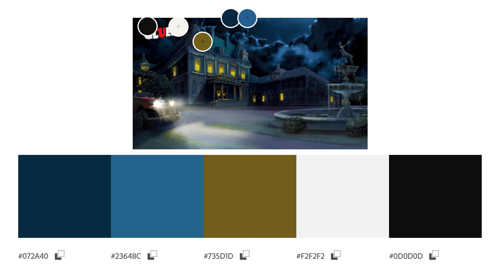

# Secrets of the Source Code 🕵️‍♂️

Secrets of the Source Code is an interactive mystery game built with Django. Players uncover the mystery by making accusations, questioning suspects, and solving cases in a turn-based system. Dive into the game and test your detective skills as you unravel the secrets of the source code! 🕵🔍

[Live Site]()

---

## CONTENTS

* [User Experience](#user-experience-ux)
  * [User Stories](#user-stories)

* [Project Planning](#agile-methodologies---project-management)

* [Design](#design)
  * [Colour Scheme](#colour-scheme)
  * [Typography](#typography)
  * [Imagery](#imagery)
  * [Wireframes](#wireframes)

* [Features](#features)
  * [General Features on Each Page](#general-features-on-each-page)
  * [Future Implementations](#future-implementations)
  * [Accessibility](#accessibility)

* [Technologies Used](#technologies-used)
  * [Languages Used](#languages-used)
  * [Frameworks, Libraries & Programs Used](#frameworks-libraries--programs-used)
  * [Use of AI](#use-of-AI)

* [Deployment & Local Development](#deployment--local-development)
  * [Deployment](#deployment)
  * [Local Development](#local-development)
    * [How to Fork](#how-to-fork)
    * [How to Clone](#how-to-clone)

* [Testing](#testing)

* [Credits](#credits)
  * [Code Used](#code-used)
  * [Content](#content)
  * [Media](#media)
  * [Acknowledgments](#acknowledgments)

---

## User Experience (UX)

### User Stories

First time, returning user and admin stories:

As a user, I want to be able to create a game session so that I can play a new round of Secrets of the source code. MUST HAVE

As a player, I want to be able to make an accusation (suspect, weapon, room) so that I can try to solve the mystery. MUST HAVE

As a player, I want to be notified when I correctly solve the mystery so that I can celebrate my victory. MUST HAVE

As a player, I want to be notified if my accusation is wrong so that I can retry and keep playing. MUST HAVE

As an admin, I want to be able to add suspects, weapons, and rooms via the admin panel so that the game can be customized. MUST HAVE

As a user, I want a simple and intuitive interface so that I can easily play the game. SHOULD HAVE

As a player, I want to restart the game after finishing a round so that I can play again. SHOULD HAVE

As a player, I want my score to be tracked across games so that I can see my performance over time and compare how well I did in each round. COULD HAVE

# Project Planning

## Agile Methodologies - Project Management

In order to visualise and manage the workflow of the project we chose to mimic the agile framework of Kanban boards via [GitHub Projects](https://github.com/users/phoebeW17/projects/7). When creating the project board we considered the "To Do," "In Progress," "In Testing," and "Done." phases. This allowed for continuous delivery and task tracking.

### MoSCoW Prioritization

I chose to follow the MoSCoW Prioritization method for SS&V, identifying and labelling my:

- **Must Haves**: the 'required', critical components of the project. Completing my 'Must Haves' helped me to reach the MVP (Minimum Viable Product) for this project early, allowing me to develop the project further than originally planned.

- **Should Haves**: the components that are valuable to the project but not absolutely 'vital' at the MVP stage. The 'Must Haves' must receive priority over the 'Should Haves'.
- **Could Haves**: these are the features that are a 'bonus' to the project, it would be nice to have them in this phase, but only if the most important issues have been completed first and time allows.
- **Won't Haves**: these features won't be implemented in this iteration.

## Design

### Wireframes

Wireframes were created for mobile and desktop using Balsamiq.

Start Page Wireframe

 

![start page]

Scenario Page Wireframe

 

![scenario page]

Accuse Page Wireframe

 

![accuse page]

Win Page Wireframe

 

![win page]

Lose Page Wireframe

 

![lose page]

### Colour Scheme

Cluedo Themed Colour Scheme

 

### Typography

We utilised [Google Fonts](https://fonts.google.com/) to find the cluedo style we were looking for.

Cluedo game Themed Fonts

 

Headings Font: https://fonts.google.com/specimen/Bangers

Sub Headings: https://fonts.google.com/specimen/Permanent+Marker

Main Font: https://fonts.google.com/specimen/Patrick+Hand

### Imagery

Cluedo Themed Imagery

 

## Features

### General features on each page

### Future Implementations

Future features include:

### Accessibility

Have you used icons and added aria-labels to enable screen readers to understand these?

Yes, aria-labels have been used throughout the html.

Have you ensured your site meets the minimum contrast requirements?

Yes

Have you chosen fonts that are dyslexia/accessible friendly?

Yes

## Technologies Used

GIT - used for version control. (git add, git commit, git push)

GITPOD - used as a cloud-based IDE for development.

HEROKU - used for hosting the deployed back-end site.

POSTGRESQL  - used as the relational database management.

CLOUDINARY - used for online static file storage.

WHITENOISE -  used for serving static files with Heroku.

FONT AWESOME - used for the icons.

### Languages Used

HTML - used for the main site content.

CSS -  used for the main site design and layout.

PYTHON - used as the back-end programming language.

### Frameworks, Libraries & Programs Used

Django - used as the Python framework for the site.

Balsamiq - Used to create wireframes.

Github - To save and store the files for the website.

Google Fonts - To import the fonts used on the website.

Google Dev Tools - To troubleshoot and test features, solve issues with responsiveness and styling.

Adobe Colors - to select a colour theme which matches our theme.

Bootstrap v5.3 - CSS framework used for design of the page.

### Use of AI

We have utilised AI to create the images in the game.

We have used Microsoft Co-pilot in the browser to aid with coding enquiries and de-bugging.

Github Co-pilot was utilised to make changes to the code within VS Code.

Chat GPT was also used.

## Deployment & Local Development

### Deployment

The live site can be found deployed on Heroku: [Here]()

## Heroku deployment

This project has been deployed via Heroku, a platform as a service enabling developers to build, run, and operate apps entirely in a cloud based environment.

To start set up an account with Heroku, then:

- Find the Heroku Dashboard and create a new app with your chosen name and region.
- In the app's settings tab, ensure that the Config Var DISABLE_COLLECTSTATIC key has a value of 1. This is only temporary and can be removed before final deployment.
- Other config vars will be added as you set up your project such as: Cloudinary key, Database URL and Secret Key.

Heroku requires these project files in order to deploy:

- requirements.txt
- Procfile
- runtime.txt

Connect your app to your GitHub project in the Deploy tab of the dashboard.

From there you can manually deploy by clicking the 'Deploy Branch' button. Your project should start to build. The build logs can be view in the 'More' menu.

The project should now be connected and deployed to Heroku!

### Local Development

#### How to Fork

To fork this repository:

1. Log in to Github.
2. Find the repository [here](https://github.com/phoebeW17/code-comrades-hack).
3. Find the fork button in the right hand corner above the About section.
4. You should now have a copy of the original repository in your own Github.

#### How to Clone

To clone the this repository:

1. Find the sharp_sound_vision repository [here](https://github.com/phoebeW17/code-comrades-hack).
2. Click on the code button, in the clone section select the option you desire to clone the project with. Then copy the URL.
3. Open the terminal in your code editor and change the current working directory to the location you want to use for the cloned directory.
4. Type 'git clone' into the terminal and then paste the link you copied in step 2. Press enter.

## Testing

We utilised Google Developer Tools as part of the ongoing testing of the site, allowing us to troubleshoot and pinpoint issues.

We have used the W3 Validator to test the html and css used on our site.

We have used WAVE to test the accessibility of our site.

We have used Lighthouse to check the performance of the site.

### Automated Testing

W3C Validator

 

JS Hint

 

WAVE

 

Lighthouse

 

### Manual Testing

### Testing User Stories

### Full Testing

## Responsivity 

 Checked for compatibility across various devices and screen sizes.

### Bugs

### Known Bugs

### Solved Bugs

## Credits

### Code Used

### Content

ReadMe:

[ReadMe Template](https://github.com/kera-cudmore/readme-examples/blob/main/milestone1-readme.md)

###  Media

Media was by AI.

###  Acknowledgments

The South Yorkshire group - thanks for the support on Slack!

Thank you to our SME Spencer Barriball and Coding Coach Roo MacArthur for their help and advice.
